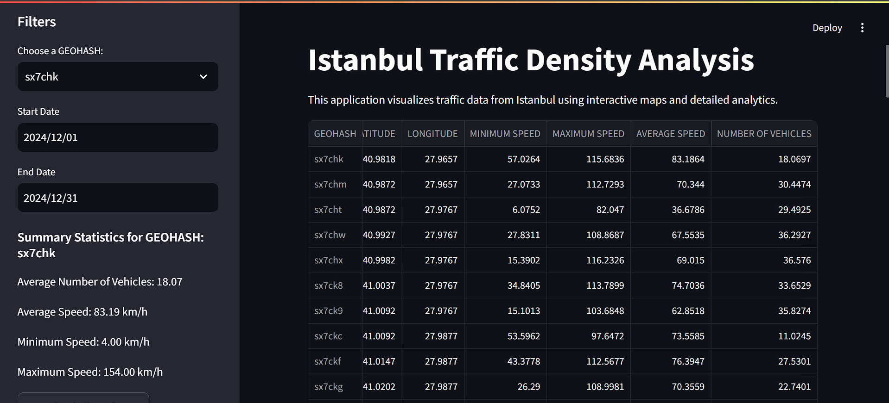
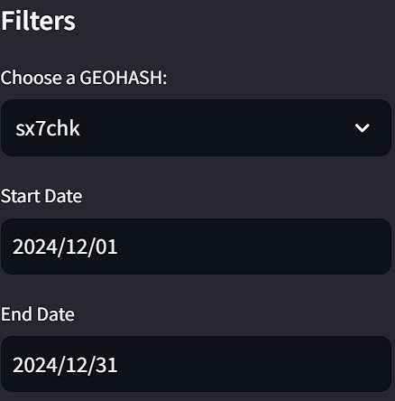
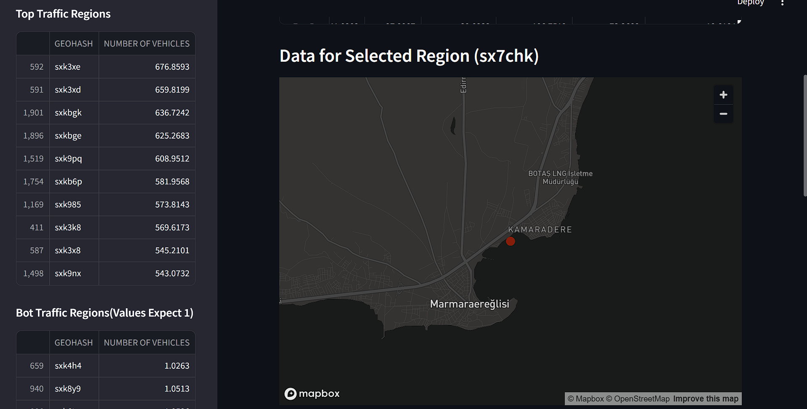
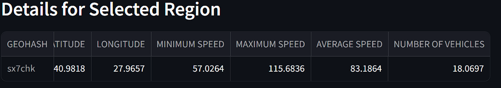
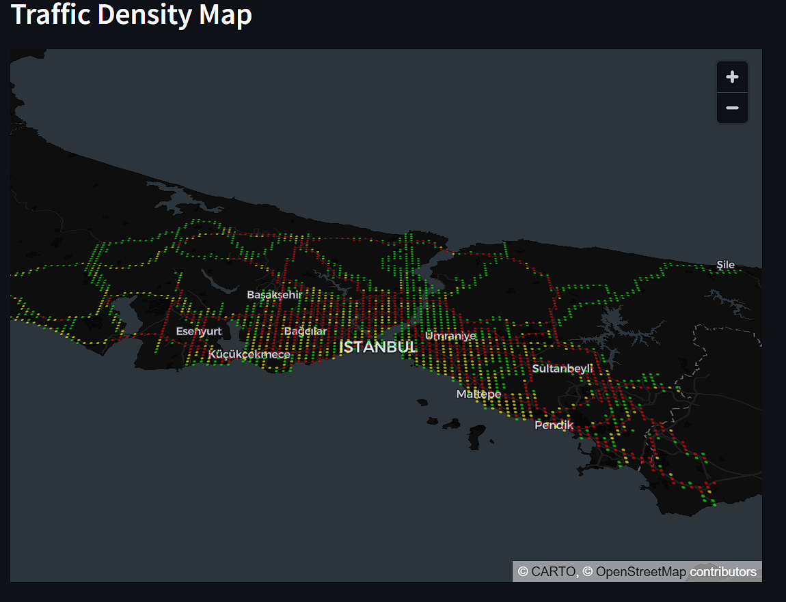
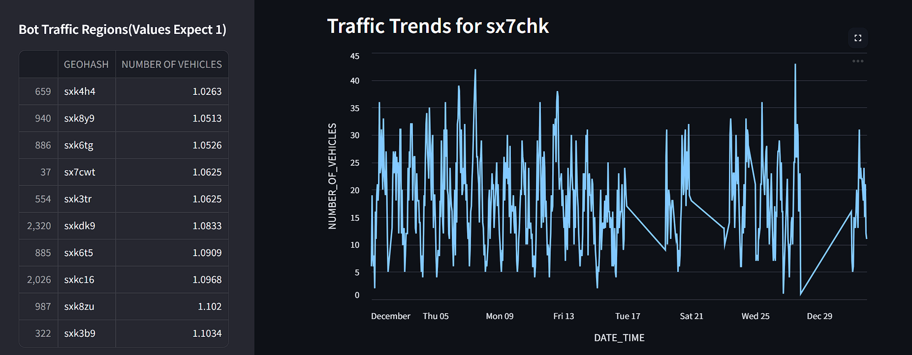

# Istanbul-Traffic-Density-Analysis-December-2024-
This Streamlit application provides a comprehensive analysis of Istanbul's traffic density using real-time data from the Istanbul Metropolitan Municipality (IMM) Open Data Portal. The project visualizes traffic patterns across different regions of Istanbul using GEOHASH-based mapping and offers interactive data exploration capabilities.
## 🚀 Features

- Interactive traffic density map
- GEOHASH-based region filtering
- Date range selection
- Real-time data analysis
- Regional traffic statistics
- Time series graphs
- Data download option
- Analysis of highest and lowest traffic regions
## 📊 Screenshots

### Statistical Dashboard

*Summary statistics and regional analysis*

### Filtering Options

*Interactive sidebar filters for data exploration*

### Data for Selected Region And Top Traffic Regions

*It shows selected region details data and top traffic regions*

### Interactive Traffic Density Map

*PyDeck visualization showing traffic density across Istanbul with color-coded indicators*

### Time Series Analysis And Bot Traffic Regions

*Traffic trends over time for selected GEOHASH regions and it shows bot traffic regions*

## 📦 Requirements
- Python 3.8+
- Streamlit
- Pandas
- PyDeck
- Altair

## 📊 Data Source

Data is obtained from the IMM(Istanbul Buyuksehir Belediyesi(IBB)) Open Data Portal. The dataset shows traffic density in Istanbul on a GEOHASH basis.

## 🔍 Usage

1. Select a GEOHASH region from the sidebar
2. View traffic density on the map
3. Examine statistics and graphs
4. Optionally download filtered data in CSV format

## 📝 License

This project is licensed under the MIT License - see the [LICENSE](LICENSE) file for details.
