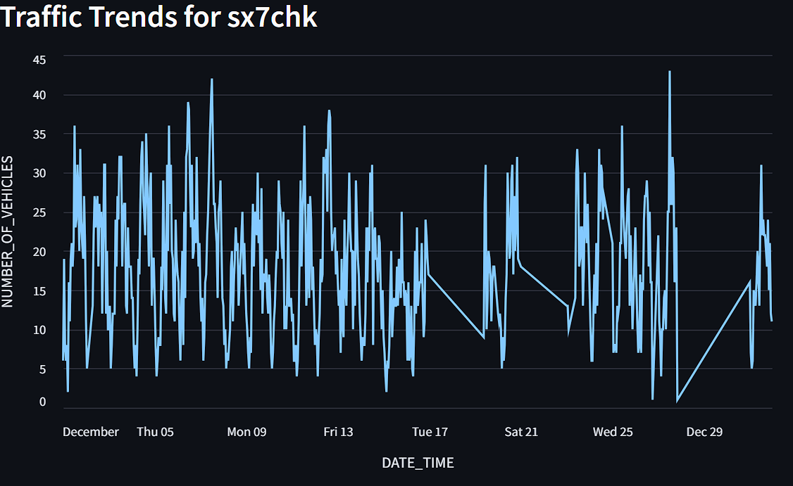

# Istanbul-Traffic-Density-Analysis-December-2024-
This Streamlit application provides a comprehensive analysis of Istanbul's traffic density using real-time data from the Istanbul Metropolitan Municipality (IMM) Open Data Portal. The project visualizes traffic patterns across different regions of Istanbul using GEOHASH-based mapping and offers interactive data exploration capabilities.
## 🚀 Features

- Interactive traffic density map
- GEOHASH-based region filtering
- Date range selection
- Real-time data analysis
- Regional traffic statistics
- Time series graphs
- Data download option
- Analysis of highest and lowest traffic regions
## 📊 Screenshots
### Interactive Traffic Density Map

*PyDeck visualization showing traffic density across Istanbul with color-coded indicators*
### Time Series Analysis

*Traffic trends over time for selected GEOHASH regions*
### Statistical Dashboard

*Summary statistics and regional analysis*
### Filtering Options

*Interactive sidebar filters for data exploration*
